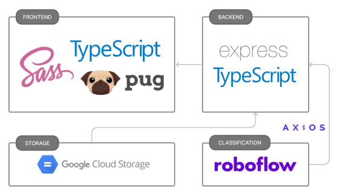

# 그림 스타일 분석 및 추천 서비스

## 🎨 소개

🕶️ [시연 영상](https://youtu.be/e7e1J4ztMN8?feature=shared) (배경음악 O)

- 사용자가 사이트에 작품 이미지를 업로드하면,
- 그림 스타일을 분석하여 다른 유사한
  작품을 추천합니다.

## 사용 기술

- Typescript
- Express
- Pug
- SCSS
- [Roboflow](https://roboflow.com/) : 이미지 분류

